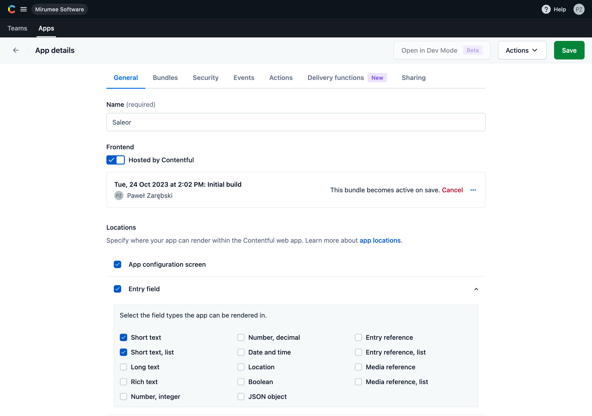
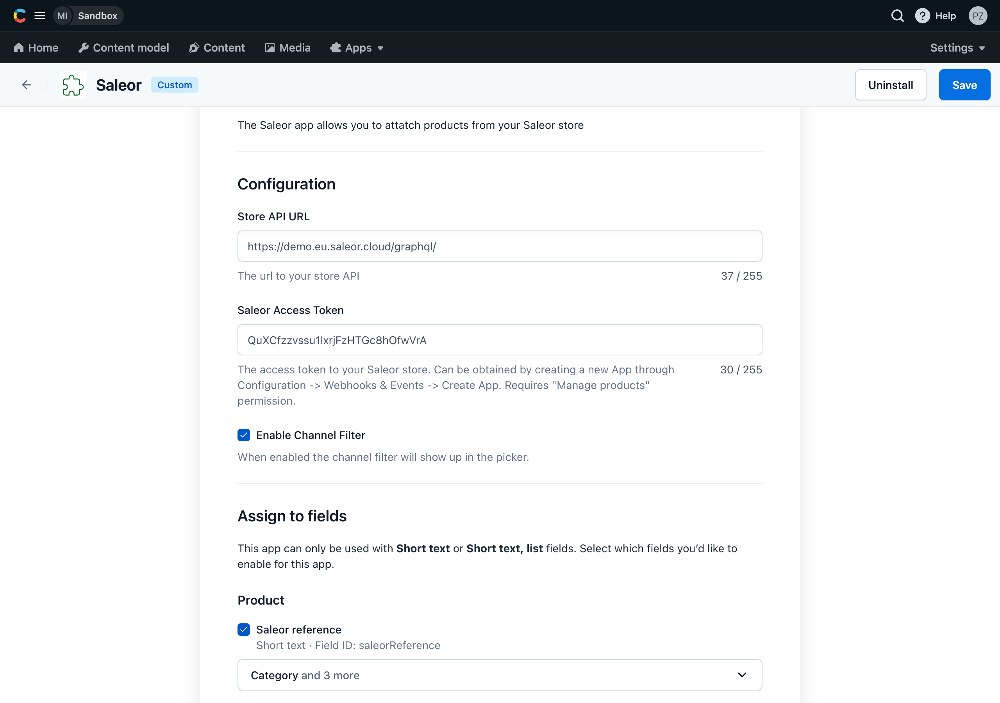
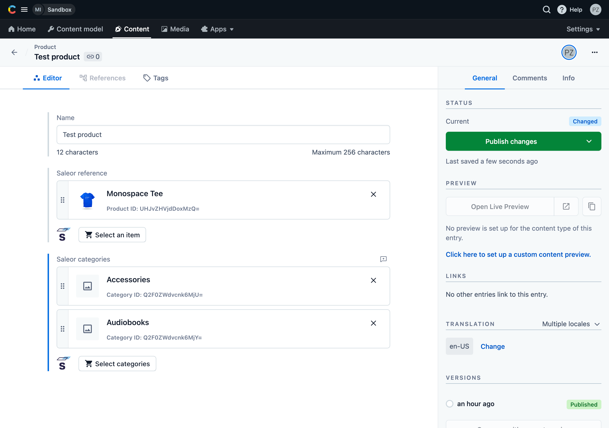
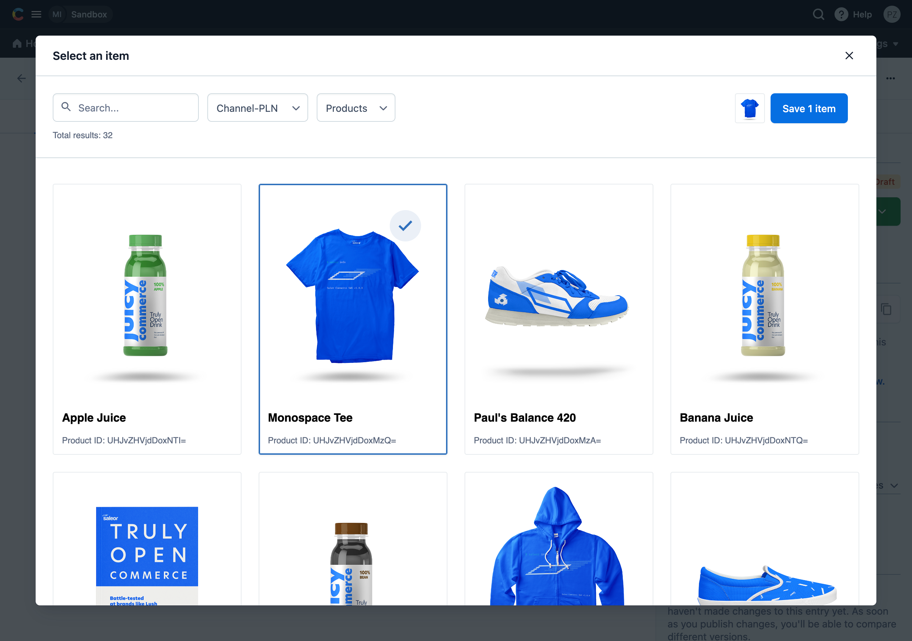

## Overview

The Saleor Contentful App allows you to easily link products from Saleor to Content through a modal inside the Contentful dashboard.

## Prerequisites

This app requires Node.js version 16 or 17 (see https://github.com/contentful/apps/blob/master/package.json).

## Installation

Currently the app is not available in the marketplace and has to be installed manually.

### Create app definition

First you need to create an app definition.

1. Create an app bundle by running `npm run build` inside the main directory.
2. Go to `Apps` -> `Installed apps` -> `Manage app definitons` (in the top right corner) -> `Create app`.
3. Inside the app details view you need to:
- Enter the name of the app (e.g. Saleor).
- Check the `Hosted by Contentful` checkbox and then upload the bundle which you've created by dragging and dropping everything what's inside the `build/` directory.
- Under the `Locations` section select `App configuration screen` and `Entry Field` (include `Short text` and `Short text, list`).
4. Click `Save` in the top right corner and then `Actions` -> `Install to space`.



### Configure the app

Once the app definition is created and the app is installed to space, you need to configure it properly.

1. Provide Saleor GraphQL API URL and Access Token (see the instruction inside the field description).
2. Choose which fields should be enabled under the `Assign to fields` section (only fields that match the app definition specs will be listed, i.e. `Short text` or `Short text, list`). Once certain field gets selected a dropdown will appear where you need to specify what kind of items can be assigned to it - `Categories, Collections, Products or Variants`.
3. Click `Install` in the top right corner and then `Save`.



For more details please refer to the Contentful apps documentation:
- https://www.contentful.com/developers/docs/extensibility/app-framework/tutorial/#embed-your-app-in-the-contentful-web-app
- https://www.contentful.com/developers/docs/extensibility/app-framework/deploy-app/

## Usage

Once the app is installed you can go to specific Content and assign Saleor items to it. Items can be filtered by IDs and can be narrowed down by channel and item type. The app will allow to select one item or multiple items based on the field type.





### Restricting the number of selected items

In order to specify a min or max number of items for the field, you need to edit the field and under the `Validation` section select the `Accept only a specified number of symbols`.

### Retrieving the data through the Contentful API

The assigned values can also be retrieved through the Contentful's GraphQL API. Assigned item data like ID, type and channel are stored as a stringified JSON.

Example response:

```json
{
    "data": {
        "product": {
            "name": "Test product",
            "saleorReference": "{\"ID\":\"UHJvZHVjdDoxMzQ=\",\"Type\":\"Product\",\"Channel\":\"channel-pln\"}",
            "saleorCategories": [
                "{\"ID\":\"Q2F0ZWdvcnk6MjU=\",\"Type\":\"Category\",\"Channel\":\"channel-pln\"}",
                "{\"ID\":\"Q2F0ZWdvcnk6MjY=\",\"Type\":\"Category\",\"Channel\":\"channel-pln\"}"
            ]
        }
    }
}
```

For more details see: https://www.contentful.com/developers/docs/references/graphql/.

## Development

In order to add some adjustments to the app and test it, you can run it locally.

1. First you need to run the app using `npm run start`.
2. Go to `Apps` -> `Installed apps` and choose `Edit app definition` for the Saleor app.
3. Under the `Frontend` section uncheck the `Hosted by Contentful` checkbox and paste http://localhost:3000 URL.
4. Save the app definition.

Now your app is hosted from your local environment and it reloads immediately after you make a change.

**Crafted with ❤️ by [Mirumee Software](http://mirumee.com)**
hello@mirumee.com
